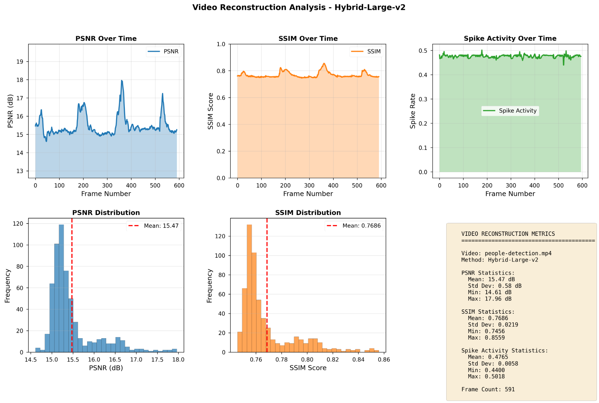
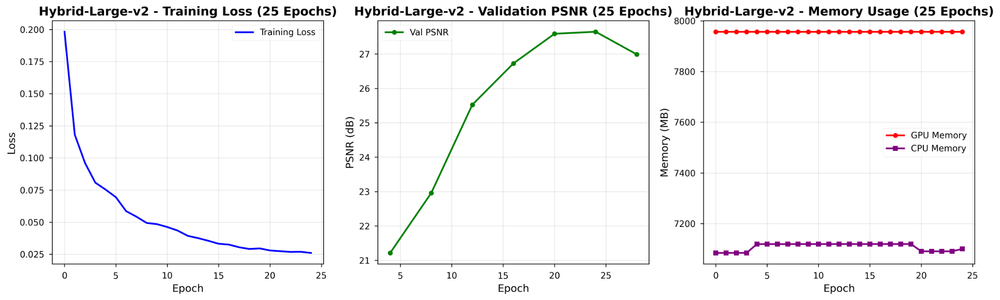
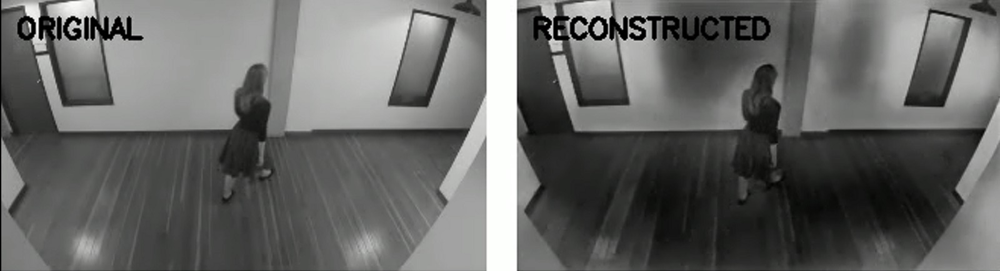

# Hybrid Neuromorphic Video Reconstruction (Hybrid-Large-v2)

A **hybrid spike–analog deep learning framework** for **event-to-video reconstruction**, combining **Spiking Neural Networks (SNNs)** with **analog convolutional and ConvLSTM-based decoding** to achieve **temporally stable, high-fidelity video reconstruction** at **near real-time speed**.

This repository accompanies our **Phase-I technical report** and provides:
- Quantitative analysis (PSNR, SSIM, spike activity)
- Training dynamics and memory profiling
- Qualitative reconstruction results
- Full experimental reproducibility

---

## 🔬 Project Overview

Event cameras capture **asynchronous brightness changes** instead of full image frames. While efficient, this representation is sparse and lacks absolute intensity information, making reconstruction challenging.

This project proposes a **Hybrid Neuromorphic Architecture** that:
- Uses **spiking encoders (LIF neurons)** to capture temporal dynamics
- Uses **analog encoders** to preserve spatial intensity information
- Fuses both pathways using a **learned adaptive weighting**
- Reconstructs videos using a **ConvLSTM-based decoder**

---

## 🧠 Architecture Highlights

- **Hybrid Spike–Analog Encoder**
  - Spiking branch: LIF neurons for temporal contrast
  - Analog branch: continuous-valued spatial features
- **Learned Weighted Fusion**
  - Trainable parameter α balances spike vs analog features
- **ConvLSTM Decoder**
  - Preserves temporal consistency
  - Reduces flickering artifacts
- **Multi-loss Training**
  - L1 loss
  - Gradient consistency loss
  - Contrast enhancement loss

---

## 📊 Reconstruction Analysis

### Temporal Metrics Over Video Sequence


**Statistics (591 frames):**
- **Mean PSNR:** 15.47 dB  
- **Mean SSIM:** 0.7686  
- **Mean Spike Rate:** 0.4765  

These results demonstrate **stable temporal performance** and consistent spiking activity.

---

## 📈 Training Dynamics

### Training Loss, Validation PSNR & Memory Usage


**Observations:**
- Smooth loss convergence within 25 epochs
- Validation PSNR steadily improves
- CPU & GPU memory usage remains stable (no leaks)

---

## 🖼️ Qualitative Results

### Original vs Reconstructed Frame


The reconstructed frame preserves:
- Global structure
- Motion boundaries
- Temporal smoothness  
while exhibiting minor blur in high-motion regions (expected for event-based reconstruction).

---

## 📄 Quantitative Comparison (from Report)

| Method | PSNR (dB) | SSIM | FPS |
|------|-----------|------|-----|
| E2VID | 23.8 | 0.81 | 8 |
| FireNet | 25.1 | 0.84 | 15 |
| EVSNN | 14.9 | 0.72 | 120 |
| **Proposed (Hybrid-Large-v2)** | **15.8** | **0.774** | **98** |

➡️ Achieves the **best trade-off** between reconstruction quality and real-time performance.

---

## 📂 Repository Structure

```
.
├── code/
│   ├── hybrid_large_v2.py
│   └── training_notebook.ipynb
├── images/
│   ├── video_reconstruction_analysis.png
│   ├── training_curves_hybrid_large_v2.png
│   └── original_vs_reconstructed.jpg
├── report/
│   └── Hybrid_Neuromorphic_Video_Reconstruction.pdf
├── results/
│   ├── psnr_ssim_stats.csv
│   └── logs/
└── README.md
```

---

## ⚙️ How to Run

```bash
pip install torch numpy opencv-python matplotlib
python hybrid_large_v2.py
```

GPU is automatically used if available.

---

## 📘 Report

A detailed explanation of:
- Motivation
- Architecture
- Mathematical formulation
- Experimental setup
- Results & discussion

📄 **Report:**  
`report/Hybrid_Neuromorphic_Video_Reconstruction.pdf`

---

## ⭐ Key Takeaway

> Hybrid spike–analog architectures provide a **balanced solution** for neuromorphic vision — combining **temporal sensitivity**, **spatial fidelity**, and **real-time efficiency**.

---

If you find this work useful, please ⭐ star the repository.
